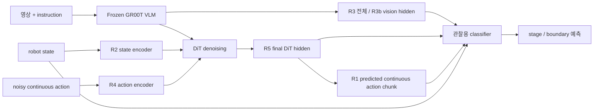
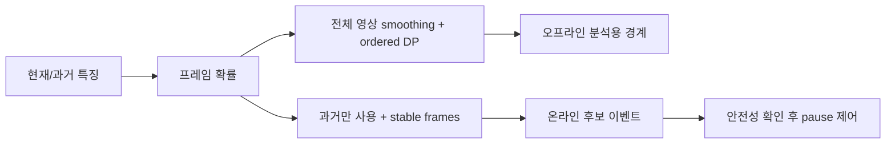

# 어떤 정보를 어떻게 분류하는가

## 구조

probe는 rollout action을 바꾸지 않고 특징만 읽습니다. 실제 pause는 별도의 제어 기능입니다.

| 표현 | 가져온 위치 | 의미 |
|---|---|---|
| R0 raw state | 인코딩 전 관절/로봇 상태 | 저비용 관측 기준선 |
| R1 action chunk | action head의 최종 연속값 출력 | 앞으로 수행하려는 행동; 실행 성공 그 자체 아님 |
| R2 state encoder | 상태 인코더 출력 | 로봇 상태의 학습된 표현 |
| R3 VLM hidden | 선택된 backbone 층 토큰, attention-mask 평균 | 영상과 instruction의 문맥 |
| R3b vision hidden | 신뢰할 수 있는 image-token mask로만 평균 | 시각 토큰 위치의 hidden; 문맥화되어 순수 이미지 embedding과 다름 |
| R4 action encoder | 마지막 denoise iteration의 action encoder, horizon 평균 | denoising 중 연속 action을 처리한 표현 |
| R5 final DiT hidden | 마지막 denoise iteration DiT, horizon 평균 | action-token-like latent; discrete token 아님 |
| R6 VLM+DiT | R3와 R5 concat | 의미 정보와 행동 표현 융합 |

LIBERO와 경사면은 embodiment/입력 구성이 다르므로 차원/추출비용도 실행별 확인해야 합니다.
경사면 특징은 Cosmos-Reason2-2B 기반 backbone의 선택 layer16,3 cameras+task text,
2048D 평균,5FPS입니다. LoRA adapter/action head를 사용하지 않고 추출한 기록입니다.
원래 instruction은 hidden에 포함되므로 `vision_mean`은 무조건적인 순수 영상 특징은 아닙니다.

## 분류기

- Linear: `z → Linear → stage logits`. 저비용 기본선.
- MLP(경사면): `D→128→64→5`, 비선형/Dropout. 학습 episode로만 scaler fit.
- causal Transformer: 과거 시퀀스를 사용, 미래 attention 차단. head 자체의 인과성은 전체 pipeline 인과성을 보장하지 않음.
- tracker: point displacement, visibility, motion 통계를 고정 길이 특징으로 만들고 같은 head 적용.
- fusion: concat 또는 vision 기본 확률에 다른 입력의 residual을 제한적으로 반영.

GR00T LIBERO linear 비교는 train-only scaler,balanced logistic regression,L2,C를 동일 validation grid로 선택,
native dimension 및 train-only common256을 동일 seed/split로 비교했습니다.
단일 rollout 사례는 C=1 고정5fold이며 위 LIBERO protocol과 다릅니다.

## 라벨의 출처

시연의 gripper release, 실제 rollout의 성공 적재, LIBERO 환경 predicate는 서로 다른 정답 정의입니다.
[기존 라벨링 방법](LABELING.md)에 자동 기준·pointing 구간의 의미·수동 판단 한계·재생성 명령을 정리했습니다.

## Stage F1과 Boundary F1

Stage macro F1은 매 시점의 **어느 단계인가**를 클래스별 동등 가중해 평가합니다.
Boundary event F1은 **단계가 바뀐 순간을 허용 오차 안에 잡았는가**를 평가합니다.
긴 단계 대부분을 맞춰 Stage F1이 높아도 경계를 몇 초 일찍 알리면 event F1은 낮을 수 있습니다.
MAE는 예측/정답 경계 시간 차이의 평균입니다. 강제로 경계를 만들면 MAE만으로 실패 감지를 평가할 수 없습니다.

## 온라인/오프라인 구분

ordered DP는 전체 영상을 보고5단계를 순서대로 강제합니다. 실패/no-boundary episode를
온라인에서 처리했다는 증거가 아니며 제어에 바로 연결하면 안 됩니다.
pause 동안 시뮬레이터/현실 시간은 계속 흐르고 inference/action 발행은 멈추며,
재개 시 최신 관측으로 새 action을 생성해야 합니다. 영상10초 정지(replay)와 다릅니다.
